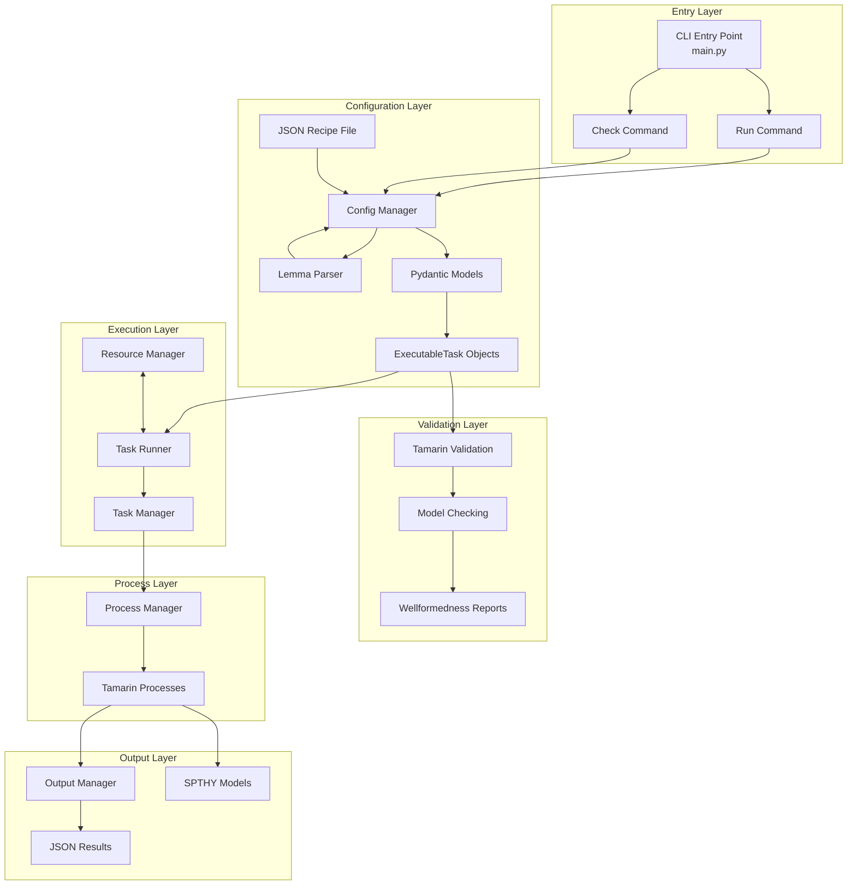
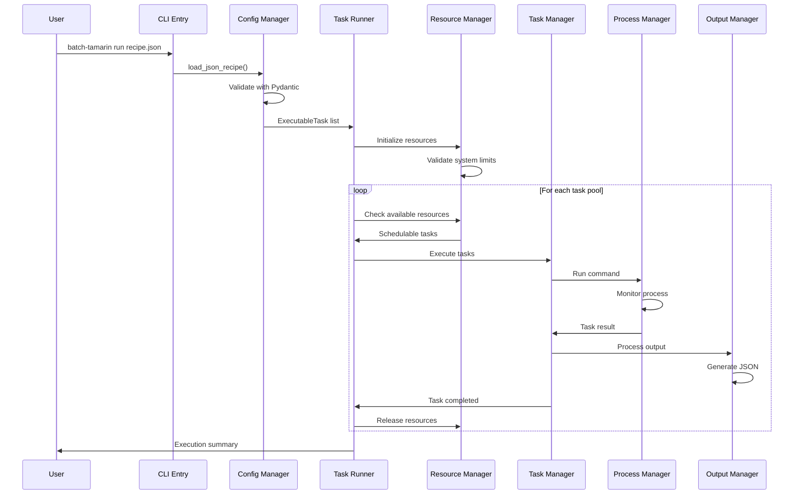
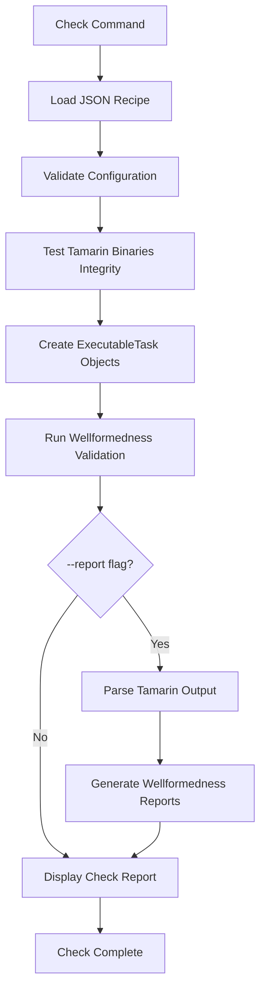

# Batch Tamarin Architecture

## Project Overview

The batch Tamarin is a Python-based orchestration tool that enables batch execution of Tamarin Prover protocol verification tasks. It provides a structured approach to running multiple protocol analyses across different Tamarin versions with comprehensive resource management, progress tracking, and result processing.

The system is designed around a modular architecture with clear separation of concerns, allowing for efficient parallel execution while maintaining resource constraints and providing detailed progress reporting.

## Project Structure

```
batch-tamarin/
├── src/batch_tamarin/                    # Main package source
│   ├── __init__.py                         # Package initialization
│   ├── main.py                             # CLI entry point with run/check commands
│   ├── runner.py                           # High-level task execution orchestration
│   │
│   ├── model/                              # Data models and type definitions
│   │   ├── __init__.py
│   │   ├── tamarin_recipe.py              # Pydantic models for JSON configuration
│   │   └── executable_task.py             # Runtime task representation and enums
│   │
│   ├── modules/                            # Core functionality modules
│   │   ├── __init__.py
│   │   ├── config_manager.py              # JSON loading, validation, transformation
│   │   ├── lemma_parser.py                # Tree-sitter based lemma extraction from theory files
│   │   ├── resource_manager.py            # Global resource tracking and scheduling
│   │   ├── task_manager.py                # Individual task execution with monitoring
│   │   ├── process_manager.py             # Low-level process management and monitoring
│   │   ├── output_manager.py              # Tamarin output parsing and result generation
│   │   └── tamarin_test_cmd.py            # Tamarin binary validation utilities
│   │
│   └── utils/                              # Utility functions and helpers
│       ├── __init__.py
│       ├── notifications.py               # User communication and logging system
│       ├── system_resources.py            # System resource detection and validation
│       └── model_checking.py              # Theory file validation and wellformedness checking
│
├── examples/                               # Example configuration files
│   ├── example_config.json                # Basic configuration example
│   └── wpa2.json                          # WPA2 protocol analysis example
│
├── scripts/                                # Development and utility scripts
│
├── pyproject.toml                          # Python project configuration
├── requirements.txt                        # Python development environment
├── tamarin-config-schema.json              # JSON schema for configuration validation
├── README.md                               # User documentation
├── RECIPE_GUIDE.md                         # Configuration guide
├── ARCHITECTURE.md                         # This file - system architecture
└── flake.nix                               # Nix development environment
```

## High-Level System Architecture

The system follows a layered architecture with clear data flow and responsibility separation:



### Architecture Layers Explained

1. **Entry Layer**: Handles CLI argument parsing with `run` and `check` commands
2. **Configuration Layer**: Validates JSON recipes and transforms them into executable objects
3. **Execution Layer**: Orchestrates parallel task execution with resource management (run command)
4. **Validation Layer**: Performs configuration validation and wellformedness checking (check command)
5. **Process Layer**: Manages individual Tamarin processes and system monitoring
6. **Output Layer**: Processes results and generates structured output files

## Component Integration Flow

The following sequence diagram shows how components interact during a typical execution:



### Integration Flow Details

- **Initialization Phase**: CLI loads configuration, validates it, and creates executable tasks
- **Resource Planning**: Resource manager validates system constraints and prepares scheduling
- **Execution Phase**: Tasks are scheduled based on available resources and executed in parallel
- **Monitoring Phase**: Each task is monitored for memory usage, timeouts, and completion
- **Output Phase**: Results are processed and saved in structured format

## Data Model Architecture

The system uses Pydantic models for configuration validation and runtime objects for execution:


## Core Components

### 1. CLI Entry Point (`main.py`)

The main entry point provides a Typer-based CLI interface with two main commands: `run` and `check`.

**Key Responsibilities:**
- Parse command-line arguments and route to appropriate command handlers
- Initialize the notification system and debug settings
- Handle version display and help information
- Orchestrate both execution and validation workflows

**Key Functions:**
- `main_callback()`: Primary CLI entry point with version handling
- `run()`: Execute tasks from configuration file
- `check()`: Validate configuration and preview tasks
- `process_config_file()`: Async orchestrator for task execution workflow
- `check_command()`: Async orchestrator for validation workflow
- `cli()`: Entry point for pip-installed command

### 2. Lemma Parser (`modules/lemma_parser.py`)

A tree-sitter based parser for extracting lemma declarations from Tamarin theory files with preprocessor support.

**Key Responsibilities:**
- Parse Tamarin Security Protocol Theory (.spthy) files using tree-sitter-spthy
- Extract all lemma declarations (lemma, diff_lemma, accountability_lemma, equiv_lemma, diff_equiv_lemma)
- Handle preprocessor directives (#ifdef, #define) with conditional compilation
- Support external preprocessor flags from configuration
- Provide robust error handling and reporting

**Implementation Details:**
- Uses `py-tree-sitter-spthy` package maintained by Luca Mandrelli <luca.mandrelli@icloud.com>
- Pre-compiled grammar binaries for major platforms and architectures (no runtime compilation needed)
- Issues and support: https://github.com/lmandrelli/py-tree-sitter-spthy/issues
- Based on grammar from vscode-tamarin

**Key Methods:**
- `parse_lemmas_from_file()`: Main entry point for parsing lemmas from a theory file
- `_extract_lemma_names()`: Recursively traverses syntax tree with preprocessor awareness
- `_extract_lemma_name_from_node()`: Extracts lemma names from different lemma node types
- `_evaluate_ifdef_condition()`: Evaluates preprocessor conditions against defined symbols
- `_traverse_ifdef_node()`: Processes only active branches in conditional compilation

**Preprocessor Features:**
- Symbol tracking from #define directives and external flags
- Conditional compilation with #ifdef evaluation
- Support for boolean expressions (AND, OR, NOT operations)
- Only processes lemmas in active preprocessor blocks

### 3. Configuration Manager (`modules/config_manager.py`)

Handles all aspects of configuration loading, validation, and transformation into executable objects.

**Key Responsibilities:**
- Load and parse JSON configuration files
- Validate configuration against Pydantic models
- Parse lemmas from theory files using LemmaParser
- Filter and configure lemmas based on task specifications
- Transform recipes into ExecutableTask objects with lemma-level granularity
- Handle Tamarin binary validation (with `modules/tamarin_test_cmd`)
- Provide detailed error reporting for configuration issues

**Key Methods:**
- `load_json_recipe()`: Loads and validates JSON recipe files
- `recipe_to_executable_tasks()`: Converts recipes to ExecutableTask objects
- `_handle_config()`: Orchestrates lemma parsing, filtering, and task creation
- `_filter_and_configure_lemmas()`: Applies task-level lemma filtering with prefix matching
- `_create_lemma_config()`: Creates LemmaConfig with proper inheritance hierarchy
- `_resolve_resources()`: Implements resource inheritance (lemma → task → global)

**Task Expansion Process:**
1. Parse all lemmas from theory file using LemmaParser
2. Filter lemmas based on task configuration (prefix matching if specified)
3. Apply inheritance for resources and options (lemma → task → global)
4. Create ExecutableTask for each lemma × tamarin version combination

### 4. Task Runner (`runner.py`)

High-level orchestration component that manages the entire task execution lifecycle.

**Key Responsibilities:**
- Coordinate parallel task execution with resource constraints
- Handle graceful shutdown and signal management
- Provide real-time progress updates and reporting
- Manage task pools and execution queues
- Handle error conditions and cleanup procedures

**Key Methods:**
- `execute_all_tasks()`: Main execution coordinator
- `_execute_task_pool()`: Parallel task execution with resource management
- `_start_schedulable_tasks()`: Intelligent task scheduling
- `_handle_completed_tasks()`: Process task completion and cleanup

## Task Execution State Machine

Tasks progress through well-defined states during their lifecycle:


### State Transitions

- **PENDING**: Task is queued and waiting for sufficient resources
- **RUNNING**: Task is actively executing with process monitoring
- **COMPLETED**: Task finished successfully with results processed
- **FAILED**: Task encountered an error during execution
- **TIMEOUT**: Task exceeded its time limit and was terminated
- **MEMORY_LIMIT_EXCEEDED**: Task exceeded memory limits and was terminated

## Resource Management System

The resource management system ensures efficient utilization while respecting system constraints:


### 5. Resource Manager (`modules/resource_manager.py`)

**Key Responsibilities:**
- Track global CPU and memory usage across all running tasks
- Implement intelligent scheduling algorithms
- Enforce global resource limits with automatic fallbacks
- Provide resource allocation and deallocation tracking
- Validate resource configurations against system capacity

**Scheduling Algorithm:**
- Prioritizes tasks that can efficiently utilize available resources
- Prevents resource over-allocation through predictive scheduling
- Balances CPU and memory constraints for optimal throughput

### 6. Task Manager (`modules/task_manager.py`)

Manages individual task execution with comprehensive monitoring and progress tracking.

**Key Responsibilities:**
- Execute ExecutableTask objects with full lifecycle tracking
- Monitor task status changes and collect execution statistics
- Generate comprehensive TaskResult objects
- Integrate with ProcessManager for actual process execution
- Provide progress reporting capabilities

**Task Lifecycle Management:**
- Status tracking from creation to completion
- Timing and memory usage collection
- Error handling and result processing
- Integration with output management

### 7. Process Manager (`modules/process_manager.py`)

Low-level process execution and monitoring component with advanced resource tracking.

**Key Responsibilities:**
- Launch and manage Tamarin processes asynchronously
- Monitor memory usage in real-time and enforce limits
- Handle process timeouts and graceful termination
- Collect stdout/stderr output comprehensively
- Track detailed process execution statistics

**Process Monitoring Features:**
- Continuous memory usage tracking with psutil
- Automatic termination when resource limits are exceeded
- Comprehensive process statistics collection
- Orphaned process cleanup and resource reclamation

## Configuration Processing Pipeline

The configuration system transforms JSON files into executable tasks through a comprehensive validation pipeline:


### Configuration Processing Steps

1. **JSON Loading**: Parse JSON file with error handling
2. **Pydantic Validation**: Validate structure and types against models
3. **Path Verification**: Check that all file paths exist and are accessible
4. **Binary Validation**: Optionally verify Tamarin executable integrity
5. **Task Expansion**: Create individual ExecutableTask objects for each combination
6. **Resource Validation**: Ensure resource requirements are feasible

## Output Processing System

The output management system processes Tamarin results and generates structured output:


### 8. Output Manager (`modules/output_manager.py`)

**Key Responsibilities:**
- Parse Tamarin execution output using regex patterns
- Extract timing information, lemma results, and warning messages
- Generate structured JSON results for both successful and failed tasks
- Manage output directory structure and file organization
- Handle error conditions and provide diagnostic information

**Output Processing Features:**
- Comprehensive output parsing with detailed result extraction
- Structured JSON format for consistent result reporting
- Automatic file organization in success/failed/models directories
- Rich error reporting with context and troubleshooting information

## File System Output Structure

The system organizes output files in a structured directory hierarchy:


### Output Structure Details

- **success/**: JSON files containing detailed results for successful task executions
- **failed/**: JSON files with error information and diagnostics for failed tasks
- **models/**: Generated .spthy model files from successful Tamarin runs

## Check Command Architecture

The check command provides configuration validation and task preview capabilities:



### Check Command Features

1. **Configuration Validation**
   - JSON structure and syntax validation
   - File path accessibility checks
   - Pydantic model validation

2. **Tamarin Binary Testing**
   - Version extraction and compatibility checks
   - Binary integrity validation
   - Executable accessibility verification

3. **Task Preview**
   - Shows all tasks that would be executed
   - Displays resource allocation breakdown
   - Groups tasks by Tamarin version

4. **Wellformedness Validation** (with `--report` flag)
   - Runs Tamarin without `--prove` flags
   - Extracts warnings and errors from output
   - Generates detailed reports in `wellformedness-check-report/` directory
   - Groups validation by unique (executable, theory_file) combinations

## Command Generation Process

ExecutableTask objects are converted to Tamarin command-line invocations:


### Command Generation Features

- **Haskell RTS Integration**: Automatic inclusion of runtime system flags for performance control
- **Flexible Lemma Targeting**: Support for both individual lemma and complete protocol analysis
- **Option Inheritance**: Lemma-specific options can override task-level settings
- **Preprocessor Support**: Automatic formatting of preprocessor flags

## Error Handling Strategy

The system implements comprehensive error handling across all components:


### Error Handling Principles

1. **Early Failure**: Configuration and validation errors stop execution immediately
2. **Graceful Degradation**: Task-level errors don't affect other tasks
3. **Resource Cleanup**: Automatic cleanup of allocated resources on failure
4. **User Communication**: Rich error messages with context and suggestions
5. **Partial Success**: Report successful tasks even when some fail

## Validation Layer Components

### Model Checking (`utils/model_checking.py`)

Provides theory file validation and wellformedness checking capabilities:

**Key Responsibilities:**
- Validate theory files with Tamarin executables without running full proofs
- Extract warnings and errors from Tamarin output
- Generate detailed wellformedness reports
- Group validation by unique (executable, theory_file) combinations to avoid duplicates

**Key Methods:**
- `validate_with_tamarin()`: Main validation orchestrator
- `parse_tamarin_output()`: Extract warnings/errors from Tamarin output
- Generates reports in `wellformedness-check-report/` directory when `--report` flag is used

### Tamarin Binary Testing (`modules/tamarin_test_cmd.py`)

Validates Tamarin executable integrity and extracts version information:

**Key Responsibilities:**
- Test Tamarin binaries with `--version` and `test` commands
- Extract version information and update TamarinVersion objects
- Verify binary accessibility and functionality
- Report testing results in check command output

## Utility Components

### System Resources (`utils/system_resources.py`)

Provides system resource detection and validation capabilities:

- **Resource Detection**: Automatically detect available CPU cores and memory
- **Limit Resolution**: Convert "max" values to actual system limits
- **Validation**: Ensure requested resources don't exceed system capacity

### Notifications (`utils/notifications.py`)

Centralized user communication and logging system:

- **Rich Output**: Formatted console output with colors and progress bars
- **Debug Support**: Detailed debug information when enabled
- **Progress Tracking**: Real-time progress updates during execution
- **Error Reporting**: Structured error messages with context
- **Check Reports**: Formatted reports for configuration validation results

## Design Patterns and Principles

### 1. Async/Await Pattern
- Enables non-blocking I/O operations for better performance
- Supports concurrent task execution without thread complexity
- Allows real-time progress monitoring and user interaction

### 2. Manager Pattern
- Separate managers for different concerns (Config, Process, Task, Resource, Output)
- Clear separation of responsibilities and single responsibility principle
- Facilitates testing, maintenance, and extensibility

### 3. Data Transformation Pipeline
- Structured transformation: JSON → Pydantic Models → ExecutableTask Objects → Commands
- Type safety throughout the pipeline with Pydantic validation
- Clear data flow with validation at each stage

### 4. Resource Pool Management
- Global resource tracking with intelligent scheduling
- Automatic resource allocation and deallocation
- Graceful handling of resource constraints

This architecture provides a robust, scalable foundation for Tamarin protocol verification automation while maintaining clear separation of concerns, comprehensive error handling, and efficient resource utilization.
