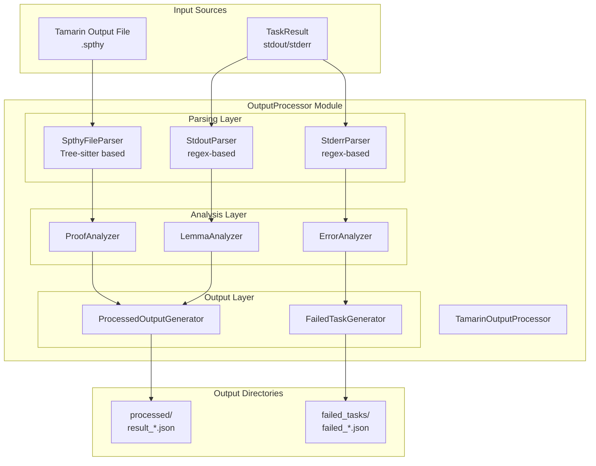
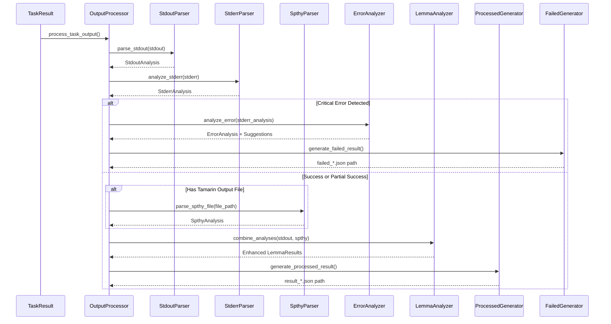

# OutputProcessor Module Architecture Plan

## Overview

The OutputProcessor module will parse Tamarin execution results and generate structured output files using a hybrid approach:

- **Regex patterns** for stdout/stderr analysis
- **Tree-sitter parsing** for spthy file processing using official Tamarin grammar
- **Hybrid approach** combining simplicity with robustness

## One-Time Setup: Tamarin Tree-sitter Grammar

The OutputProcessor uses the official Tamarin tree-sitter grammar via git subtree (one-time setup by maintainer):

```bash
# One-time setup (already done for this project)
git subtree add --prefix=vendor/tree-sitter-spthy \
    --squash \
    https://github.com/tamarin-prover/tamarin-prover.git \
    develop:tree-sitter/tree-sitter-spthy
```

### Build Script: setup_treesitter.py

Create this file in project root:

```python
#!/usr/bin/env python3
"""Build script for Tamarin tree-sitter grammar."""

import sys
from pathlib import Path

try:
    from tree_sitter import Language
except ImportError:
    print("Error: tree-sitter not installed. Run: pip install tree-sitter")
    sys.exit(1)

def build_tamarin_grammar():
    """Build the Tamarin spthy tree-sitter grammar from subtree."""

    grammar_dir = Path("vendor/tree-sitter-spthy")
    if not grammar_dir.exists():
        print("Error: Tamarin tree-sitter grammar not found in vendor/tree-sitter-spthy")
        sys.exit(1)

    build_dir = Path("src/tamarin_wrapper/modules/parsers/build")
    build_dir.mkdir(parents=True, exist_ok=True)

    print("Building Tamarin spthy tree-sitter grammar...")
    try:
        Language.build_library(
            str(build_dir / "tamarin-spthy.so"),
            [str(grammar_dir)]
        )
        print("✓ Grammar built successfully")

    except Exception as e:
        print(f"Error building grammar: {e}")
        print("Ensure you have: C compiler, Node.js, and tree-sitter installed")
        sys.exit(1)

def verify_setup():
    """Verify that the tree-sitter setup works."""
    grammar_path = Path("src/tamarin_wrapper/modules/parsers/build/tamarin-spthy.so")

    if not grammar_path.exists():
        return False

    try:
        Language(str(grammar_path), 'spthy')
        return True
    except:
        return False

if __name__ == "__main__":
    import argparse
    parser = argparse.ArgumentParser()
    parser.add_argument("--verify", action="store_true")
    args = parser.parse_args()

    if args.verify:
        if verify_setup():
            print("✓ Tree-sitter setup working")
        else:
            print("✗ Setup verification failed")
            sys.exit(1)
    else:
        build_tamarin_grammar()
```

### Dependencies Update

Add to `pyproject.toml`:

```toml
dependencies = [
    # ... existing dependencies
    "tree-sitter>=0.20.4",
]

[tool.setuptools.package-data]
"tamarin_wrapper.modules.parsers" = ["build/*.so"]
```

## Architecture Components



## Enhanced Data Models

### Core Analysis Results

```python
@dataclass
class StdoutAnalysis:
    """Results from parsing stdout using regex patterns"""
    analyzed_file: str
    output_file: str
    processing_time: float
    warnings: List[str]
    lemma_results: Dict[str, LemmaResult]
    maude_version_warning: Optional[str] = None
    tool_version_info: Optional[str] = None

@dataclass
class StderrAnalysis:
    """Results from analyzing stderr for error patterns"""
    error_type: Optional[ErrorType]
    error_patterns_found: List[str]
    context_lines: List[str]
    is_critical_error: bool
    tamarin_logs: List[str]

@dataclass
class SpthyAnalysis:
    """Results from tree-sitter based spthy file parsing"""
    theory_name: str
    lemmas: Dict[str, SpthyLemmaInfo]
    functions: List[FunctionDeclaration]
    rules: List[RuleDeclaration]
    restrictions: List[RestrictionDeclaration]
    parsing_errors: List[str]

@dataclass
class SpthyLemmaInfo:
    """Detailed lemma information extracted from spthy file"""
    name: str
    attributes: List[str]  # [sources], [reuse], etc.
    analysis_type: str     # all-traces, exists-trace
    formula: str
    proof_status: str      # proven, unproven, failed
    proof_method: Optional[str]  # induction, contradiction, etc.
    proof_steps: Optional[List[str]]
    line_number: int
    end_line: int
```

### Enhanced Output Models

```python
@dataclass
class ProcessedTaskResult:
    """Final processed result for successful tasks"""
    task_id: str
    status: str
    processing_time: float
    lemma_results: Dict[str, EnhancedLemmaResult]
    warnings: List[str]
    metadata: ProcessingMetadata
    spthy_analysis: Optional[SpthyAnalysis]
    timestamp: datetime

@dataclass
class EnhancedLemmaResult:
    """Combined lemma info from stdout parsing and spthy analysis"""
    name: str
    status: str  # verified, falsified, analysis_incomplete
    analysis_type: str  # all-traces, exists-trace
    steps: Optional[int]
    time_ms: Optional[int]

    # Enhanced from spthy analysis
    proof_method: Optional[str]
    proof_details: Optional[List[str]]
    attributes: List[str]
    formula: Optional[str]
    line_number: Optional[int]

@dataclass
class ProcessingMetadata:
    """Metadata about the processing operation"""
    analyzed_file: str
    output_file: str
    theory_name: Optional[str]
    total_lemmas_found: int
    lemmas_with_proofs: int
    parsing_errors: List[str]
    maude_version_warning: Optional[str]

@dataclass
class FailedTaskResult:
    """Enhanced failure analysis with suggestions"""
    task_id: str
    error_analysis: ErrorAnalysis
    suggested_modifications: TaskModifications
    raw_outputs: RawOutputSummary
    context_info: FailureContext
    timestamp: datetime

@dataclass
class FailureContext:
    """Additional context for failure analysis"""
    theory_name: Optional[str]
    partial_lemma_results: Dict[str, LemmaResult]
    last_successful_lemma: Optional[str]
    failure_point: Optional[str]
    resource_usage: Optional[Dict[str, Any]]
```

## Core Implementation Classes

### 1. TamarinOutputProcessor (Main Orchestrator)

```python
class TamarinOutputProcessor:
    """
    Main processor coordinating hybrid parsing approach.
    """

    def __init__(self, output_directory: Path):
        self.output_directory = Path(output_directory)
        self.processed_dir = self.output_directory / "processed"
        self.failed_tasks_dir = self.output_directory / "failed_tasks"

        # Initialize parsers
        self.stdout_parser = StdoutParser()
        self.stderr_parser = StderrParser()
        self.spthy_parser = SpthyFileParser()

        # Initialize analyzers
        self.error_analyzer = ErrorAnalyzer()
        self.lemma_analyzer = LemmaAnalyzer()
        self.proof_analyzer = ProofAnalyzer()

        # Initialize generators
        self.processed_generator = ProcessedOutputGenerator()
        self.failed_generator = FailedTaskGenerator()

    def process_task_output(
        self,
        task_result: TaskResult,
        tamarin_output_file: Optional[Path] = None,
        lemma_filter: Optional[str] = None
    ) -> Path:
        """Main processing entry point with enhanced error handling"""
```

### 2. StdoutParser (Regex-based)

```python
class StdoutParser:
    """
    Enhanced stdout parser with comprehensive pattern matching.
    """

    # Enhanced regex patterns based on provided specifications
    PATTERNS = {
        'summary_section': re.compile(
            r'==============================================================================\n'
            r'summary of summaries:(.*?)'
            r'(?:==============================================================================|$)',
            re.DOTALL
        ),
        'tool_version_warning': re.compile(
            r'(.*maude tool version.*behind.*tamarin binary.*)',
            re.IGNORECASE
        ),
        'analyzed_file': re.compile(r'analyzed:\s+(.+)'),
        'output_file': re.compile(r'output:\s+(.+)'),
        'processing_time': re.compile(r'processing time:\s+([\d.]+)s'),
        'warnings': re.compile(r'WARNING:\s+(.+?)(?=\n|$)', re.MULTILINE),
        'wellformedness_warning': re.compile(
            r'WARNING:\s+(\d+)\s+wellformedness check.*failed.*analysis results.*wrong',
            re.IGNORECASE | re.DOTALL
        ),
        'lemma_result': re.compile(
            r'(\w+)\s+\((all-traces|exists-trace)\):\s+'
            r'(verified|falsified|analysis incomplete)\s+'
            r'\((\d+)\s+steps?\)'
        )
    }

    def parse(self, stdout: str) -> StdoutAnalysis:
        """Parse stdout and extract structured information"""

    def _extract_summary_section(self, stdout: str) -> Optional[str]:
        """Extract the summary of summaries section"""

    def _parse_lemma_results(self, summary_text: str) -> Dict[str, LemmaResult]:
        """Parse lemma results from summary section"""

    def _detect_version_warnings(self, stdout: str) -> Optional[str]:
        """Detect and categorize version-related warnings"""
```

### 3. StderrParser (Error Pattern Detection)

```python
class StderrParser:
    """
    Advanced stderr analysis with comprehensive error categorization.
    """

    ERROR_PATTERNS = {
        ErrorType.MEMORY_EXHAUSTED: [
            re.compile(r'Heap exhausted', re.IGNORECASE),
            re.compile(r'Current maximum heap size', re.IGNORECASE),
            re.compile(r'out of memory', re.IGNORECASE),
            re.compile(r'Allocation failed', re.IGNORECASE),
            re.compile(r'cannot allocate', re.IGNORECASE)
        ],
        ErrorType.TIMEOUT: [
            re.compile(r'Process timed out', re.IGNORECASE)
        ],
        ErrorType.SYNTAX_ERROR: [
            re.compile(r'Parse error', re.IGNORECASE),
            re.compile(r'Syntax error', re.IGNORECASE),
            re.compile(r'malformed', re.IGNORECASE)
        ],
        ErrorType.SYSTEM_ERROR: [
            re.compile(r'cannot read file', re.IGNORECASE),
            re.compile(r'Permission denied', re.IGNORECASE),
            re.compile(r'Directory not found', re.IGNORECASE),
            re.compile(r'Error writing', re.IGNORECASE),
            re.compile(r'Failed to generate', re.IGNORECASE)
        ],
        # ... additional patterns based on specifications
    }

    def analyze(self, stderr: str) -> StderrAnalysis:
        """Analyze stderr for error patterns and context"""

    def _extract_context_lines(self, stderr: str, error_patterns: List[str]) -> List[str]:
        """Extract relevant context lines around errors"""

    def _filter_tamarin_logs(self, stderr: str) -> List[str]:
        """Separate Tamarin debug logs from actual errors"""
```

### 4. SpthyFileParser (Tree-sitter based)

```python
import tree_sitter
from tree_sitter import Language, Parser, Node

class SpthyFileParser:
    """
    Tree-sitter based parser using official Tamarin spthy grammar.
    Focuses on lemma and proof extraction for output processing.
    """

    def __init__(self):
        # Load the compiled Tamarin spthy language from subtree
        grammar_path = Path(__file__).parent / "build" / "tamarin-spthy.so"
        self.language = Language(str(grammar_path), 'spthy')
        self.parser = Parser()
        self.parser.set_language(self.language)

    def parse_file(self, file_path: Path) -> SpthyAnalysis:
        """Parse spthy file using tree-sitter and extract structured information"""
        content = file_path.read_text(encoding='utf-8')
        tree = self.parser.parse(content.encode('utf8'))

        return self._extract_analysis(tree.root_node, content)

    def _extract_analysis(self, root: Node, content: str) -> SpthyAnalysis:
        """Extract structured information from parse tree"""
        theory_name = self._extract_theory_name(root, content)
        lemmas = self._extract_lemmas(root, content)

        return SpthyAnalysis(
            theory_name=theory_name,
            lemmas=lemmas,
            functions=[],  # Can be extended later
            rules=[],      # Can be extended later
            restrictions=[], # Can be extended later
            parsing_errors=[]  # Tree-sitter provides error recovery
        )

    def _extract_lemmas(self, root: Node, content: str) -> Dict[str, SpthyLemmaInfo]:
        """Extract all lemmas from parse tree"""
        lemmas = {}
        lemma_nodes = self._find_nodes_by_type(root, 'lemma')

        for lemma_node in lemma_nodes:
            lemma_info = self._parse_lemma_node(lemma_node, content)
            if lemma_info:
                lemmas[lemma_info.name] = lemma_info

        return lemmas

    def _parse_lemma_node(self, lemma_node: Node, content: str) -> Optional[SpthyLemmaInfo]:
        """Parse individual lemma node and extract proof information"""
        # Extract lemma name
        name_node = lemma_node.child_by_field_name('lemma_identifier')
        if not name_node:
            return None
        name = self._get_node_text(name_node, content)

        # Extract attributes [sources], [reuse], etc.
        attributes = self._extract_lemma_attributes(lemma_node, content)

        # Extract trace quantifier (all-traces, exists-trace)
        trace_quantifier = self._extract_trace_quantifier(lemma_node, content)

        # Extract formula
        formula_node = lemma_node.child_by_field_name('formula')
        formula = self._get_node_text(formula_node, content) if formula_node else ""

        # Extract proof information
        proof_status, proof_method = self._extract_proof_info(lemma_node, content)

        return SpthyLemmaInfo(
            name=name,
            attributes=attributes,
            analysis_type=trace_quantifier or "all-traces",
            formula=formula,
            proof_status=proof_status,
            proof_method=proof_method,
            proof_steps=[],  # Can be enhanced later
            line_number=lemma_node.start_point[0] + 1,
            end_line=lemma_node.end_point[0] + 1
        )

    def _extract_proof_info(self, lemma_node: Node, content: str) -> Tuple[str, Optional[str]]:
        """Extract proof status and method from lemma"""
        proof_skeleton_node = lemma_node.child_by_field_name('proof_skeleton')
        if not proof_skeleton_node:
            return "unproven", None

        # Check for different proof types
        if self._find_nodes_by_type(proof_skeleton_node, 'solved'):
            return "proven", "automatic"
        elif self._find_nodes_by_type(proof_skeleton_node, 'by_method'):
            method_nodes = self._find_nodes_by_type(proof_skeleton_node, 'proof_method')
            if method_nodes:
                method = self._get_node_text(method_nodes[0], content)
                if 'sorry' in method.lower():
                    return "unproven", "sorry"
                else:
                    return "proven", method
        elif self._find_nodes_by_type(proof_skeleton_node, 'cases'):
            return "proven", "cases"

        return "unproven", None

    def _extract_lemma_attributes(self, lemma_node: Node, content: str) -> List[str]:
        """Extract lemma attributes like [sources], [reuse], etc."""
        attrs = []
        # Implementation depends on tree-sitter grammar structure
        return attrs

    def _extract_trace_quantifier(self, lemma_node: Node, content: str) -> Optional[str]:
        """Extract trace quantifier (all-traces, exists-trace)"""
        quantifier_node = lemma_node.child_by_field_name('trace_quantifier')
        if quantifier_node:
            return self._get_node_text(quantifier_node, content)
        return None

    def _extract_theory_name(self, root: Node, content: str) -> str:
        """Extract theory name from parse tree"""
        theory_nodes = self._find_nodes_by_type(root, 'theory')
        if theory_nodes:
            name_node = theory_nodes[0].child_by_field_name('theory_name')
            if name_node:
                return self._get_node_text(name_node, content)
        return "Unknown"

    def _find_nodes_by_type(self, root: Node, node_type: str) -> List[Node]:
        """Find all nodes of specific type in tree"""
        nodes = []

        def traverse(node: Node):
            if node.type == node_type:
                nodes.append(node)
            for child in node.children:
                traverse(child)

        traverse(root)
        return nodes

    def _get_node_text(self, node: Node, content: str) -> str:
        """Extract text content from node"""
        return content[node.start_byte:node.end_byte]
```

## Processing Workflow



## File Output Formats

### Successful Task Output (`processed/result_{task_id}.json`)

```json
{
	"task_id": "wpa2_stable_secrecy",
	"wrapper_reported_ressource_usage": {
		"peak_memory_mb": 5120,
		"average_memory_mb": 4500,
		"execution_time_s": 12.41
	},
	"processing_time": 12.41,
	"verified_lemmas": {
		"secrecy": {
			"name": "secrecy",
			"analysis_type": "all-traces",
			"steps": 8,
			"time_ms": 5200,
			"proof_method": "induction",
			"proof_details": [
				"case (last #i. Secret(x) @ i)",
				"by induction on the length of the trace"
			],
			"attributes": ["sources"],
			"formula": "All x #i. Secret(x) @ i ==> not (Ex #j. K(x) @ j)",
			"line_number": 1904
		}
	},
	"falsified_lemmas": {
		"authentication": {
			"name": "authentication",
			"analysis_type": "exists-trace",
			"steps": 3,
			"time_ms": 1500,
			"proof_method": "contradiction",
			"proof_details": [
				"case (Ex #i. AuthComplete(A,B) @ i)",
				"by contradiction with the authentication trace"
			],
			"attributes": ["sources"],
			"formula": "Ex #i. AuthComplete(A,B) @ i",
			"line_number": 2050
		}
	},
	"analysis_incomplete_lemmas": ["complex_authentication", "key_exchange"],
	"warnings": [
		"1 wellformedness check failed! The analysis results might be wrong!"
	],
	"metadata": {
		"analyzed_file": "protocols/wpa2_four_way_handshake.spthy",
		"output_file": "results/tamarin_output_models/tam_stable_wpa2_secrecy.spthy",
		"theory_name": "WPA2_Four_Way_Handshake",
		"total_lemmas_found": 3,
		"lemmas_with_proofs": 2,
		"parsing_errors": [],
		"maude_version_warning": null
	}
}
```

### Failed Task Output (`failed_tasks/failed_{task_id}.json`)

```json
{
  "task_id": "complex_protocol_timeout",
  "return_code": -1,
  "error": {
    "error_type": "timeout",
    "description": "Task exceeded timeout limit during proof search", #if this is an expected error, null if not
    "last_stderr_lines": [
       # last lines from stderr
    ],
    "suggested_fixes": [
      # to do later
    ]
  },
  "resource_usage": {
    "peak_memory_mb": 7800,
    "execution_time_s": 300
  }
}
```

## Directory Structure

```
src/tamarin_wrapper/modules/
├── output_processor.py          # Main processor
├── parsers/
│   ├── __init__.py
│   ├── stdout_parser.py         # Regex-based stdout parsing
│   ├── stderr_parser.py         # Error pattern detection
│   ├── spthy_parser.py          # Tree-sitter based spthy parsing
│   └── build/                   # Compiled tree-sitter grammars
│       └── tamarin-spthy.so     # Compiled Tamarin grammar
├── analyzers/
│   ├── __init__.py
│   ├── error_analyzer.py        # Error categorization + suggestions
│   ├── lemma_analyzer.py        # Lemma result enhancement
│   └── proof_analyzer.py        # Proof method detection
└── generators/
    ├── __init__.py
    ├── processed_generator.py    # Success case JSON generation
    └── failed_generator.py       # Failure case JSON generation

vendor/                          # Git subtrees
└── tree-sitter-spthy/          # Tamarin grammar (via git subtree)

setup_treesitter.py              # Build script (project root)
```

This architecture provides a robust, maintainable foundation for parsing Tamarin outputs while leveraging the official grammar through a clean git subtree integration managed by project maintainers.
